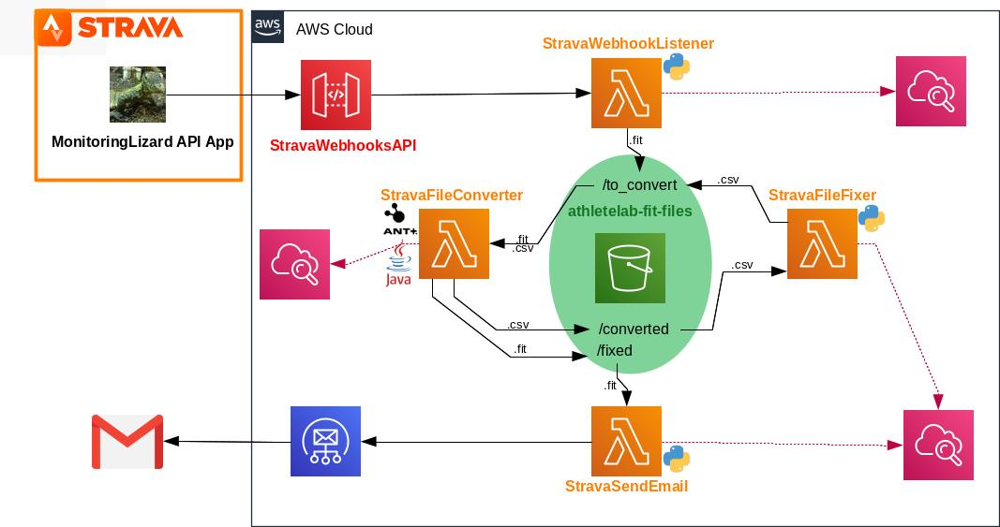

# Strava automation

Documentation for the Strava automation project: making things happen when a new file is uploaded to Strava.

## Infrastructure


## Setup notes
These are some instructions to automate the fixing of `.fit` files uploaded to Strava (e.g. applying interpolation when there are missing data points). It relies on:

1. A Strava App with webhooks enabled. This means that when a new `.fit` file is uploaded to the account (and when the activity is deleted or modified), the app will publish an event.
1. AWS API Gateway to connect the Strava webhook event to a lambda function that downloads the original `.fit` file. The API Gateway enables the lambda function to listen to the events published by the Strava App. If the event is the creation of a new activity, the lambda function will download the original `.fit` file and store it in an S3 bucket.
1. An S3 bucket to store files for a period of time. The S3 bucket is also set up to trigger events when files are uploaded to it, triggering the correct lambda function.
1. A lambda function that is able to use the Fit SDK tool to convert between `.fit` and `.csv` formats. This lambda function invokes the Fit SDK tool, and therefore it is written in Java
1. A lambda function to modify the csv data.
1. A lambda function to compose an email with a presigned url to download the fixed `.fit` file.
1. AWS SES to send the email.
1. CloudWatch collecting logs from the different AWS services.

### Setting up the Strava App with webhooks

The first step to get API access to Strava is to create an app. The official instructions are in [https://developers.strava.com/](https://developers.strava.com/).

Once you have creatde your app, you need to get Strava to enable webhooks for it. This involves sending them an email with the app's client id, as described here: [https://developers.strava.com/docs/webhooks/](https://developers.strava.com/docs/webhooks/)

### AWS API Gateway

The AWS API Gateway is the bridge between the Strava events and the lambda function that we want to be triggered when a new `.fit` file has been uploaded to Strava.

The `StravaWebhooksAPI` contains a `GET` method to perform the handshake required to stablish the subscription, and a `POST` method that is used during event delivery.

Create those methods, and use lambda proxy integration. This means that the lambda function will be responsible for handling the request, and its details will be available in the `event` parameter of the lambda handler. The lambda function that will be the backend is `StravaWebhookListener`.

Create a stage. This gives us a url that can be used to invoke the API, and is what we need to connect to the Strava Webhooks.

To make development easier, the name of the lambda function is specified with the use of stage variables. There is a stage variable that holds the alias of the lambda function to use in production (`lambdaAlias`), and the lambda function name specified in the integration is referred as: `StravaWebhookListener:${StageVariables.lambdaAlias}`.

To connect `StravaWebhooksAPI` to Strava, a new subscription needs to be created. This is done by running (locally from a terminal) a `POST` request as in the example in [https://developers.strava.com/docs/webhooks/](https://developers.strava.com/docs/webhooks/)

```
curl -X POST https://api.strava.com/api/v3/push_subscriptions \
      -F client_id=5 \
      -F client_secret=7b2946535949ae70f015d696d8ac602830ece412 \
      -F 'callback_url=https://XXXXXXXX.execute-api.AWS-Region.amazonaws.com/StageName' \
      -F 'verify_token=STRAVA'
```
In this case, the callback url is the stage invoke url of the API Gateway.

This starts the handshake between the Strava App and the AWS API GAteway, making the Strava App send a response to the callback url. The listener, in this case the `StravaWebhooksListener` lambda function, needs to reply with the `hub.challenge` value in the response from Strava. This can be extracted from the `event` parameter passed to the lambda handler function, and returned. See the code in [`StravaWebhookListener`](https://github.com/leogargu/StravaWebhookListener). When this is done, the subscription is sucessful and the `StravaWebhooksAPI` will start receiving all events from the Strava App, passing them onto `StrabaWebhooksListener` for processing.

### Downloading the original `.fit` file

This is done by the [`StravaWebhooksListener`](https://github.com/leogargu/StravaWebhookListener) lambda function.

Currently the Strava API does not support downloading the original `.fit` files, but this can be done by appending `export_original` to the activity url. For this reason, this step cannot be done using the Strava App's token: it needs the usename and password for the Strava account in order to authenticate the download url.

This lambda function has dependencies that are not included in the AWS SDK for Python. For this reason, its dependencies need to be included in the deployment package (and so, using UI for editing the lambda code is no longer an option). The simplest way to do this is to use the virtual environment used for development locally, and package the dependencies as explained here: [https://docs.aws.amazon.com/lambda/latest/dg/lambda-python-how-to-create-deployment-package.html#python-package-dependencies](https://docs.aws.amazon.com/lambda/latest/dg/lambda-python-how-to-create-deployment-package.html#python-package-dependencies).

When the Strava App publishes the "New Activity" event, the API Gateway invokes the `StravaWebhookListener` lambda function, which then downloads the corresponding original file and saves it into the `to_convert` folder in the S3 bucket. This triggers the `StravaFileConverter` function. 

### Converting between `.fit` and `.csv` files

Conversion between `.fit` and `.csv` formats can be done using the Fit SDK tool from [This Is Ant](https://www.thisisant.com/resources/fit). This is a Java binary that can be invoked from the command line, e.g.

```
java -jar FitCSVTool.jar -b <FIT FILE> <CSV FILE>
java -jar FitCSVTool.jar -c <CSV FILE> <FIT FILE>
```

Because the JRE is needed for the tool to work, the AWS lambda function that will invoke it needs to be Java based. This is the [`StravaFileConverter`](https://github.com/leogargu/StravaFileConverter) function. The simplest way to develop it is to use the Eclipse IDE for Java developers (I used the Luna service Release 2, 4.4.2), and install the AWS toolkit for Eclipse with the Lambda plugin. Instructions are here: [https://docs.aws.amazon.com/toolkit-for-eclipse/v1/user-guide/lambda.html](https://docs.aws.amazon.com/toolkit-for-eclipse/v1/user-guide/lambda.html). Once installed, it is possible to select New Project > AWS > AWS Lambda Java Project, which sets up the project correctly. It uses Maven for building.

Deployment of the lambda function is best done directly from the Eclipse UI, by opening the context menu and selecting Amazon Web Services > Upload function to AWS Lambda. This step packages all the dependencies in a zip file and deploys it. It is important to include the `FitCSVTool.jar` as a dependency in the `pom.xml`, so that it is packaged correctly.

The `StravaFileConverter` is triggered by the upload of `.fit` or `.csv` files to the `to_convert` folder in the S3 bucket. If the file to convert is `.fit`, the converted `.csv` file is put into the `converted` folder. If the file to convert is `.csv`, the converted `.fit` file is placed in the `fixed` folder of the S3 bucket.

### Modifying the csv data

The `StravaFileFixer` lambda function modifies the converted `.csv` file, and saves it in `.csv` format in the folder `converted` of the S3 bucket. This triggers the `StravaFileConverter` function to convert the file into `.fit` and put it into the `fixed` folder in the S3 bucket.

### Using lambda to compose an email

When a new `.fit` file is uploaded to the `fixed` folder in the S3 bucket, the [`StravaSendEmail`](https://github.com/leogargu/StravaSendEmail) lambda function is triggered. It generates a signed url to the new file, which expires after a period of time. It composes the email and sends it using SES. Step-by-step instructions are here:

[https://docs.aws.amazon.com/ses/latest/DeveloperGuide/send-using-sdk-python.html](https://docs.aws.amazon.com/ses/latest/DeveloperGuide/send-using-sdk-python.html)


### Using SES to deliver the email

The email addresses that [`StravaSendEmail`](https://github.com/leogargu/StravaSendEmail) will send the email to need to be verified within SES. More information here: [https://docs.aws.amazon.com/ses/latest/DeveloperGuide/verify-email-addresses.html](https://docs.aws.amazon.com/ses/latest/DeveloperGuide/verify-email-addresses.html)

### S3 set up

The S3 bucket has event notifications set up to trigger the relevant lambda function when objects are put in each folder, and also a lifecycle policy to purge old files. The objects are saved with metadata containing the activity id, the original name and external id (name of the original `.fit` file uploaded). All lambda functions read and replicate this data during modifications and conversions.